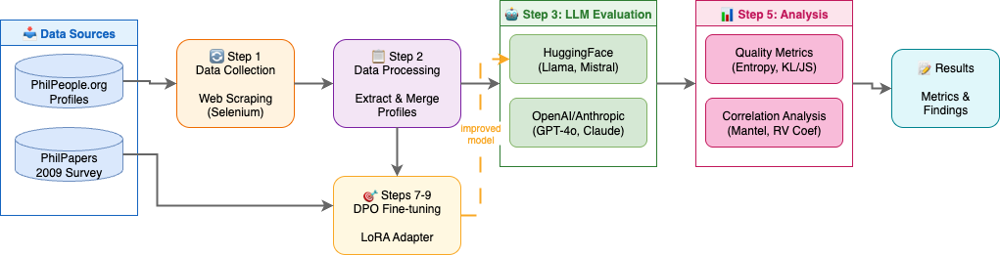

# Silicon Sampling of Professional Philosophers

Replication code for the paper **"Silicon Sampling of Professional Philosophers: Evaluating Algorithmic Fidelity in Expert Reasoning"**

This repository provides a complete pipeline for:
1. Collecting philosopher profile data from PhilPeople.org
2. Evaluating LLMs on philosophical survey questions (silicon sampling)
3. Analyzing response quality via multiple metrics (Mantel test, RV coefficient, KL/JS divergence)
4. Fine-tuning models with DPO to improve fidelity

## 📋 Table of Contents

- [Overview](#overview)
- [Installation](#installation)
- [Quick Start](#quick-start)
- [Pipeline Steps](#pipeline-steps)
- [Evaluation Metrics](#evaluation-metrics)
- [Troubleshooting](#troubleshooting)
- [File Structure](#file-structure)
- [Data Formats](#data-formats)
- [Citation](#citation)

## Overview

**Silicon sampling** conditions LLMs on individual demographic profiles to generate synthetic survey responses. This repository tests whether LLMs can faithfully simulate professional philosophers' positions on philosophical questions.

### Pipeline Overview



### Key Findings

- LLMs exhibit **inflated demographic-position correlations** (up to 3× stronger than human data)
- Some correlations are **fabricated** rather than learned from human data
- DPO fine-tuning improves **structural coherence** but reduces **response diversity**

### Supported Models

| Provider | Models |
|----------|--------|
| **OpenAI** | GPT-4o, GPT-5.1|
| **Anthropic** | Claude Sonnet 4.5 |
| **HuggingFace** | Llama 3.1 8B, Mistral 7B, Qwen 2.5 - 0.5B, Qwen 3 - 4B|

## Installation

### Prerequisites

- Python 3.9+
- Chrome browser (for web crawling)
- 8GB+ RAM (for small models)
- (Optional) CUDA-capable GPU for larger models for DPO fine-tuning

### Setup

```bash

# Clone the repository and Create virtual environment
python -m venv venv
source venv/bin/activate  # On Windows: venv\Scripts\activate

# Install dependencies
pip install -r requirements.txt
```

### API Keys (for closed-source models)

```bash
export OPENAI_API_KEY="your-openai-key"
export ANTHROPIC_API_KEY="your-anthropic-key"
export HF_TOKEN="your-huggingface-token"  # For gated models like Llama
```

## Quick Start

### Run Complete Pipeline

```bash
# Make executable (first time only)
chmod +x run_pipeline.sh

# Run full pipeline
./run_pipeline.sh

# Skip crawling (use existing data)
./run_pipeline.sh --skip-crawl

# Limit crawling to 10 profiles
./run_pipeline.sh --limit 10

# Skip DPO training
./run_pipeline.sh --skip-dpo
```

### Pipeline Options

| Option | Description |
|--------|-------------|
| `--skip-crawl` | Skip data crawling (use existing data) |
| `--skip-eval` | Skip model evaluation |
| `--skip-dpo` | Skip DPO training |
| `--skip-analysis` | Skip analysis step |
| `--limit N` | Limit crawling to N profiles |
| `--model MODEL` | HuggingFace model to use |
| `--help` | Show help message |

## Pipeline Steps

### Step 1: Data Collection

```bash
# Crawl PhilPeople profile views
python 1a_crawl_philpeople_views.py --limit 10

# Scrape profile details
python 1b_scrape_profile_details.py

# Crawl PhilPapers survey (may be blocked by Cloudflare)
python 1c_crawl_philpapers_survey.py --limit 5

# Parse manually downloaded HTML (Cloudflare workaround)
python 1d_parse_manual_download.py
```

### Step 2: Data Processing

```bash
python 2a_process_crawled_html.py
python 2b_merge_philosopher_data.py
python 2c_merge_survey_with_philosophers.py
```

### Step 3: LLM Evaluation

```bash
# Configure MODEL_PROVIDER in 3_model_eval.py:
# - "huggingface" for HuggingFace models
# - "openai" for OpenAI models  
# - "anthropic" for Anthropic models

python 3_model_eval.py
```

### Step 4: Post-Processing

```bash
python 4a_process_model_results.py
python 4b_merge_llm_responses.py
python 4c_normalize_question_names.py
```

### Step 5: Analysis

```bash
python 5a_compute_quality_metrics.py
python 5b_correlation_analysis.py
python 5c_compute_all_model_correlations.py
```

### Step 6-7: DPO Fine-tuning

```bash
# Prepare DPO dataset (with anonymized names)
python 6_prepare_dpo_dataset.py

# Fine-tune model with DPO
python 7_finetune_dpo.py
```

### Step 8: Comparison

```bash
# Compare base vs fine-tuned model (outputs table)
python 8_compare_finetuning.py
```

## Evaluation Metrics

### Correlation Structure Metrics

| Metric | Description | Range | Ideal |
|--------|-------------|-------|-------|
| **RV Coefficient** | Multivariate similarity between correlation matrices | 0-1 | Higher |
| **Mantel Test** | Statistical correlation between matrices | -1 to 1 | Higher |
| **Element-wise r** | Pearson correlation of matrix elements | -1 to 1 | Higher |

### Distribution Metrics

| Metric | Description | Range | Ideal |
|--------|-------------|-------|-------|
| **KL Divergence** | Information loss from human to model | 0-∞ | Lower |
| **JS Divergence** | Symmetric divergence measure | 0-1 | Lower |

### Response Quality Metrics

| Metric | Description | Range | Ideal |
|--------|-------------|-------|-------|
| **Shannon Entropy** | Information content per question | 0-log₂(n) | Higher |
| **Effective Categories** | 2^entropy, effective unique values | 1-n | Higher |

## Troubleshooting

### CUDA Out of Memory

```python
# In 7_finetune_dpo.py, reduce batch size:
BATCH_SIZE = 1
```

### Selenium Driver Error

```bash
pip install selenium webdriver-manager
# Ensure Chrome browser is installed
```

### Cloudflare Blocking

PhilPapers may block automated requests. Workaround:
1. Open profiles manually in browser
2. Save HTML files to `philosopher_profiles/`
3. Run `python 1d_parse_manual_download.py`

### Model Loading Issues

```bash
# For gated models, set HF token
export HF_TOKEN="your-token"

# Or use smaller model
MODEL_NAME = "Qwen/Qwen2.5-0.5B-Instruct"
```

## File Structure

```
organized_scripts/
├── run_pipeline.sh                  # 🚀 Main pipeline runner
│
├── 1a_crawl_philpeople_views.py     # Step 1: Crawl PhilPeople views
├── 1b_scrape_profile_details.py     # Step 1: Scrape profile details
├── 1c_crawl_philpapers_survey.py    # Step 1: Crawl PhilPapers survey
├── 1d_parse_manual_download.py      # Step 1: Parse manual downloads
│
├── 2a_process_crawled_html.py       # Step 2: Process HTML
├── 2b_merge_philosopher_data.py     # Step 2: Merge data
├── 2c_merge_survey_with_philosophers.py
│
├── 3_model_eval.py                  # Step 3: Unified model evaluation
│
├── 4a_process_model_results.py      # Step 4: Process results
├── 4b_merge_llm_responses.py        # Step 4: Merge responses
├── 4c_normalize_question_names.py   # Step 4: Normalize questions
│
├── 5a_compute_quality_metrics.py    # Step 5: Quality metrics
├── 5b_correlation_analysis.py       # Step 5: Correlation analysis
├── 5c_compute_all_model_correlations.py
│
├── 6_prepare_dpo_dataset.py         # Step 6: Prepare DPO data (anonymized)
├── 7_finetune_dpo.py                # Step 7: DPO fine-tuning
├── 8_compare_finetuning.py          # Step 8: Compare models (table output)
│
├── requirements.txt                 # Dependencies
├── WORKFLOW_DIAGRAM.md              # Visual pipeline diagram
├── pipeline-transparent.drawio.png  # Pipeline flowchart
│
└── test_data/                       # Sample data for testing
    ├── philpeople_profiles.json
    ├── philosophers_with_countries.json
    ├── philosopher_details.json
    ├── survey_responses_all_reprocessed.json
    ├── question_answer_options.json
    ├── philosopher_dpo_train.jsonl
    └── philosopher_dpo_val.jsonl
```

## Data Formats

### Philosopher Profile Format

```json
{
  "name": "John Doe",
  "url": "https://philpeople.org/profiles/john-doe",
  "areas_of_specialization": ["Philosophy of Mind", "Ethics"],
  "areas_of_interest": ["Consciousness"],
  "phd_institution": "Harvard University",
  "phd_country": "United States",
  "current_institution": "MIT",
  "year_of_phd_degree": 2015,
  "responses": {
    "free will: compatibilism": 0.75,
    "mind: physicalism": 1.0
  }
}
```

### Response Value Encoding

| Stance | Numeric Value |
|--------|---------------|
| Accept | 1.0 |
| Lean towards | 0.75 |
| Neutral | 0.5 |
| Lean against | 0.25 |
| Reject | 0.0 |

### Supported HuggingFace Models

| Model | Size | Notes |
|-------|------|-------|
| `Qwen/Qwen2.5-0.5B-Instruct` | 494M | Fast, good for testing |
| `Qwen/Qwen3-4B-Instruct-2507` | 4B | Good balance |
| `meta-llama/Llama-3.1-8B-Instruct` | 8B | Requires HF token |
| `mistralai/Mistral-7B-Instruct-v0.2` | 7B | Strong performance |

